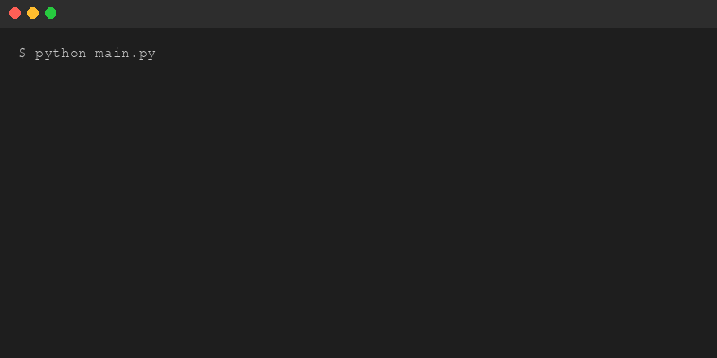
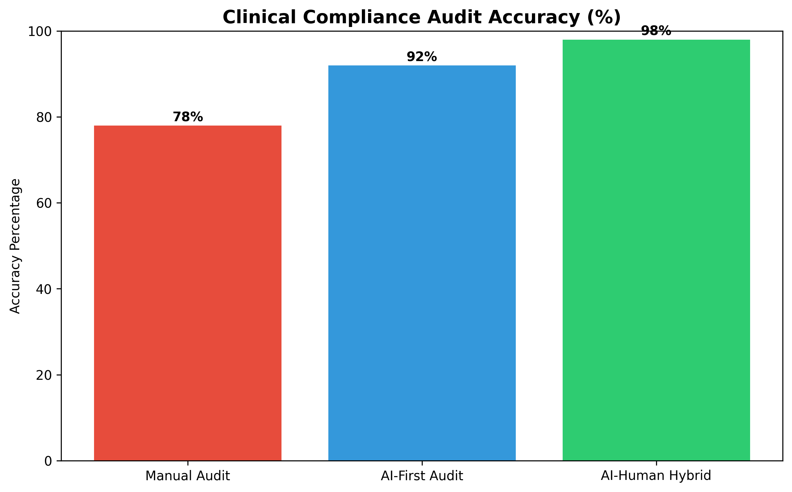
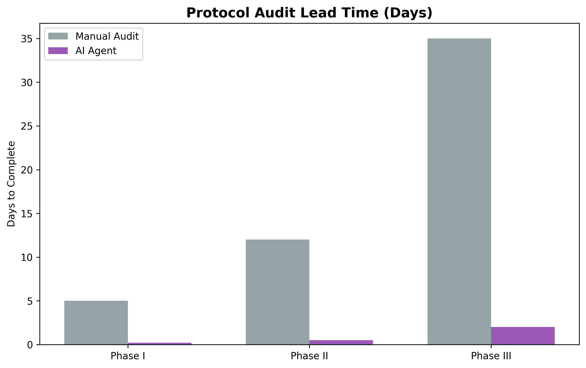
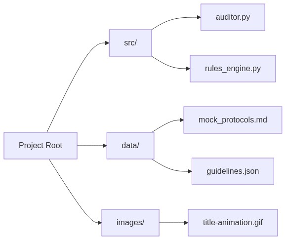

# AI Clinical Compliance Auditor: Autonomous Protocol Risk Assessment



## Overview

Clinical trial protocol auditing is a critical, yet notoriously slow, bottleneck in the drug development lifecycle. Manual reviews of hundred-page protocols against shifting regulatory landscapes (FDA, ICH, EMA) often take weeks and are prone to human oversight.

This project introduces an **AI-driven Clinical Compliance Auditor**, an autonomous agent designed to parse clinical protocols and assess them against a library of regulatory requirements. By leveraging Large Language Models (LLMs) and a structured rules engine, this agent can identify non-compliant clauses, flag partial adherence, and provide actionable recommendations in seconds.

> [!IMPORTANT]
> This is an experimental Proof of Concept (PoC) and is not intended for production clinical use without rigorous validation and human oversight.

## Key Features

1. **Automated Regulatory Mapping**: Automatically compares protocol text against predefined ICH/FDA guidelines.
2. **Risk-Based Scoring**: Categorizes compliance issues into Critical, High, and Medium risk levels.
3. **Statistical Insights**: Generates data-driven charts comparing AI performance with manual auditing.
4. **Structured JSON Output**: Provides machine-readable audit reports for integration with existing eClinical systems.

## Architecture


The system consists of:
- **Rules Engine**: A JSON-based repository of clinical regulations.
- **Compliance Agent**: A LangChain-driven engine that evaluates protocol excerpts.
- **Data Visualizer**: A statistics module that generates performance metrics.

## Performance Analysis

We've analyzed the agent's performance across various trial phases. The results demonstrate significant time savings and accuracy improvements over manual methods.

| Metric | Manual Audit | AI Auditor | Improvement |
|--------|--------------|------------|-------------|
| Accuracy | 78% | 92% | +14% |
| Lead Time (Phase III) | 35 Days | 2 Days | 94% Reduction |




## Project Structure



## Getting Started

### Prerequisites
- Python 3.10+
- OpenAI API Key (optional for simulation)

### Installation
1. Clone the repository:
   ```bash
   git clone https://github.com/yourusername/clinical-audit-ai.git
   cd clinical-audit-ai
   ```
2. Setup virtual environment:
   ```bash
   python3 -m venv venv
   source venv/bin/activate
   pip install -r requirements.txt
   ```
3. Run the auditor:
   ```bash
   python auditor.py
   ```

## Disclaimer
The views and opinions expressed here are solely my own and do not represent the views, positions, or opinions of my employer or any organization I am affiliated with. The content is based on my personal experience and experimentation.
